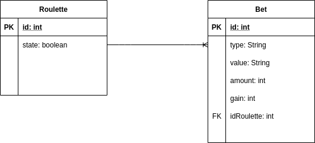

# masivian_test

El presente proyecto es una prueba para aplicar al cargo de Java Junior Developer

**Diagrama Entidad-Relación**



**Script para la creación de la base de datos**

```sql
DROP TABLE IF EXISTS roulette;
DROP TABLE IF EXISTS bet;

CREATE TABLE roulette
(
    id    INT PRIMARY KEY       NOT NULL auto_increment,
    state BOOLEAN DEFAULT false NOT NULL
);

CREATE TABLE bet
(
    id          INT PRIMARY KEY NOT NULL auto_increment,
    kind        VARCHAR(7)      NOT NULL,
    value       VARCHAR(7)      NOT NULL,
    amount      INT             NOT NULL,
    gain        DOUBLE          NOT NULL,
    id_roulette INT REFERENCES roulette (id),
    id_user     INT             NOT NULL
); 
```
